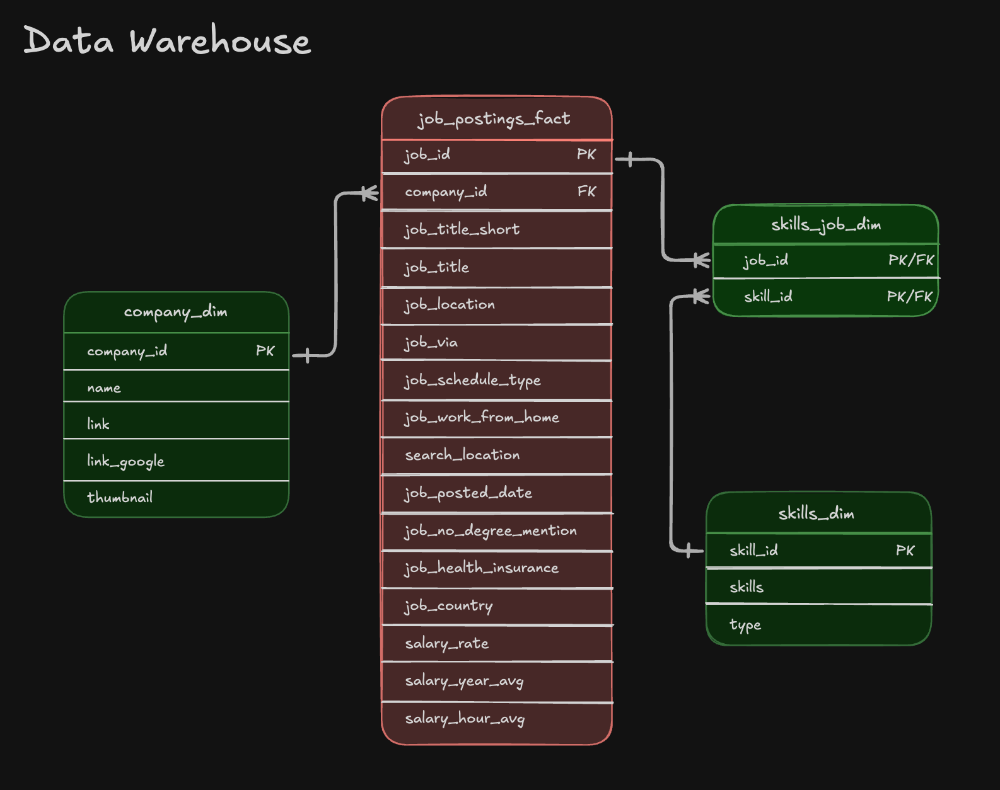

# Exploratory Data Analysis w/ SQL: Job Market Analysis

A SQL project analyzing the datqa engineer job market using real world job posting data.  It demonstrates my ability to **write productionb-quality analytical SQL, design efficient queries, and turn business questions into data-driven insights**.

## Executive Summary

- ✅ **Project Scope:** Built **3 analytical queries** that answer key questions about the data engineer job market
- ✅ **Data Modeling:** Used **multi-table joins** across fact and demension tables to extract insights
- ✅ **Analytics:** Applied **aggregations, filtering, and sorting** to find top skills by demand, salary, and overall value
- ✅ **Outcomes:** Delivered **actionable insights** on SQL/Python dominance, cloud trends, and salary patters

If you only have a minute, review these:

1. [`01_top_demanded_skills.sql`](./01_top_demanded_skills.sql) - demand analysis with multi-table joins
2. [`02_top_paying_skills.sql`](./02_top_paying_skills.sql) - salary analysis with aggregations
3. [`03_optimal_skills.sql`](./03_optimal_skills.sql) - combined demand/salary optimization query

## Problem & Context

Job Market analysts need to answer questions like:

- 🎯 **Most in-demand:** *Which skills are most in-demand for data engineers?*
- 💰 **Highest Paid:** *Which skills command the highest salaries?*
- ⚖️ **Best trade-off:** *What is the optimal skill set balancing demand and compensation?*

This project analyzes a **data warehouse** build using a star schema design.  The warehouse structure consists of:

- **Fact Table** `job_postings_fact` - Central table containing job posting details (job titles, locations, salaries, dates, etc.)
- **Diemension Tables:**
  - `company_dim` - Company information linke to job postings
  - `skills_dim` - Skills catalog with skill names and types
- ** Bridge Table:** `skills_job_dim` - Resolves the many-to-many relationship between job postings and skills

BY querying across these interconnected tabled, I extrated insights about skill demand, salary patterns, and optimal skill combinaitons for data engineering roles.

## Tech Stack

- 🪿 **Query Engine:** DuckDB for fast OLAP-Style analytical queries
- 🖥️ **language:** SQL (ANSI-style with analytical functions)
- 📊 **Data Model:** Star schema with fact + dimension + bridge tables
- 🛠️ **Development:** VS Code for SQL editing + Terminal for DuckDB CLI
- 📦 **Version Control:** Git/GitHub for versioned SQL scipts

## Analysic Overview

### Query Structure

1. **[Top Demanded Skills](./01_top_demanded_skills.sql)** - Identifies the top 10 most in-demand skills for remote data engineer positions
2. **[Top Paying Skills](./02_top_paying_skills.sql)** - Analyzes the top 25 highest-paying skills with salary and demand metrics
3. **[Optimal Skills](./03_optimal_skills.sql)** - Calculates an optimal score using natural log of demand combined with median salary to identify the most valuable skills to learn

### Key Insights

- 🧠 Core languages: SQL and Python each appear in ~29,000 job postings, making them the most demanded skills
- ☁️ Cloud platforms: AWS and Azure are critical for modern data engineering roles-
- 🧱 Infra & tooling: Kubernetes, Docker, and Terraform are associated with preimium salaries
- 🔥 Big data tools: Apache Spark shows strong demand with competitive compensation 

## SQL Skills Demonstrated

### Query Design and Optimization

- **Complex Joins**: Multi-table `Inner Join` operations across: `job_postings_fact`, `skills_job_dim`, and `skills_dim`
- **Aggregations** `Count()`, `Median()`, `Round()`,
for statistical analysis
- **Filering**: Boolean logic with `Where` clauses and multiple consisions (`job_title_short`, `job_work_from_home`, `salary_year_avg is not null`)
- **Sorting & Limiting**: `Order By` with `Desc` and `Limit`

### Data Analysis Techniques

- **Grouping**: `Group By` for categorical analysis by skill
- **Mathematical Functions**: `LN()` for natural logarithm transformation to normalize demand metrices
- **Calculated Metrics**: Derived optimal scoring combining log-transformation to normalize demand metrics
- **HAVING Clause**: Filtering aggregated results (skills with >= 100 postings) 
- **NULL Handling**: Proper filtering of incomplete records (`salary_year_avg is not null`)